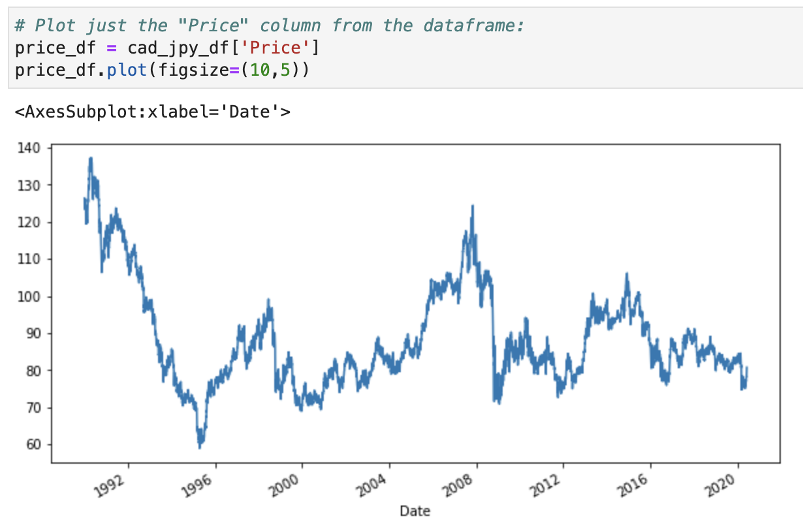
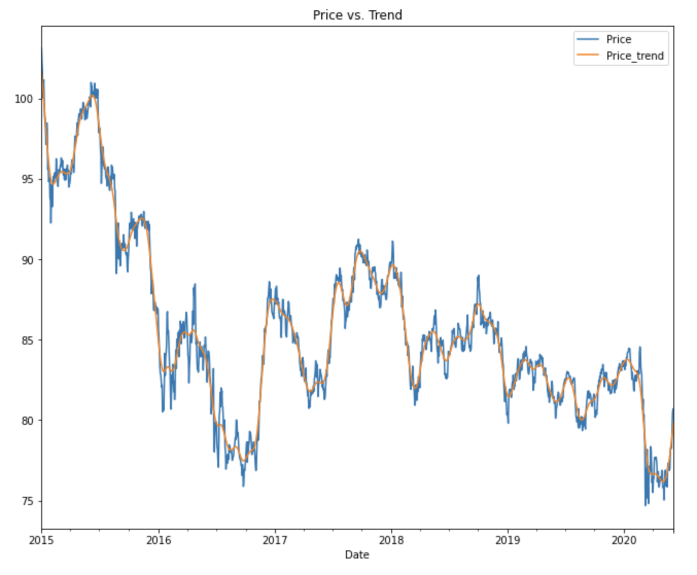
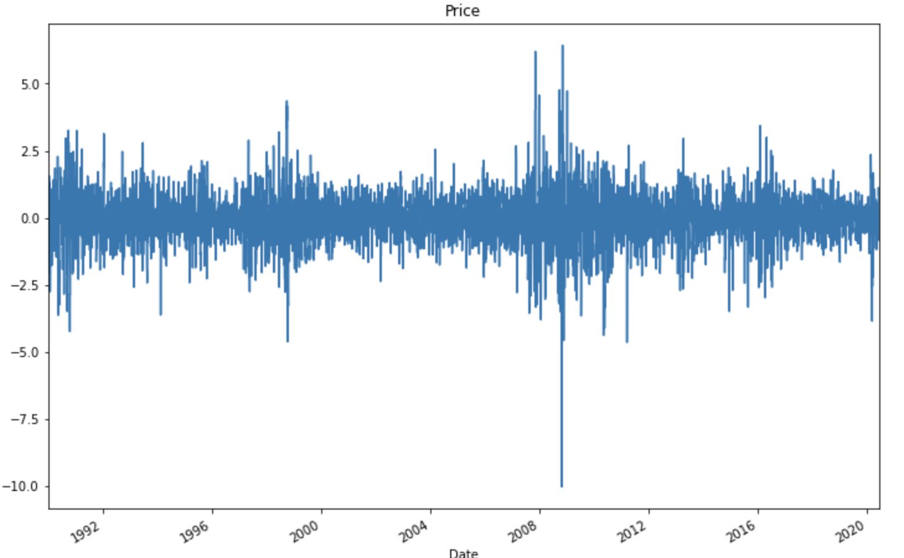
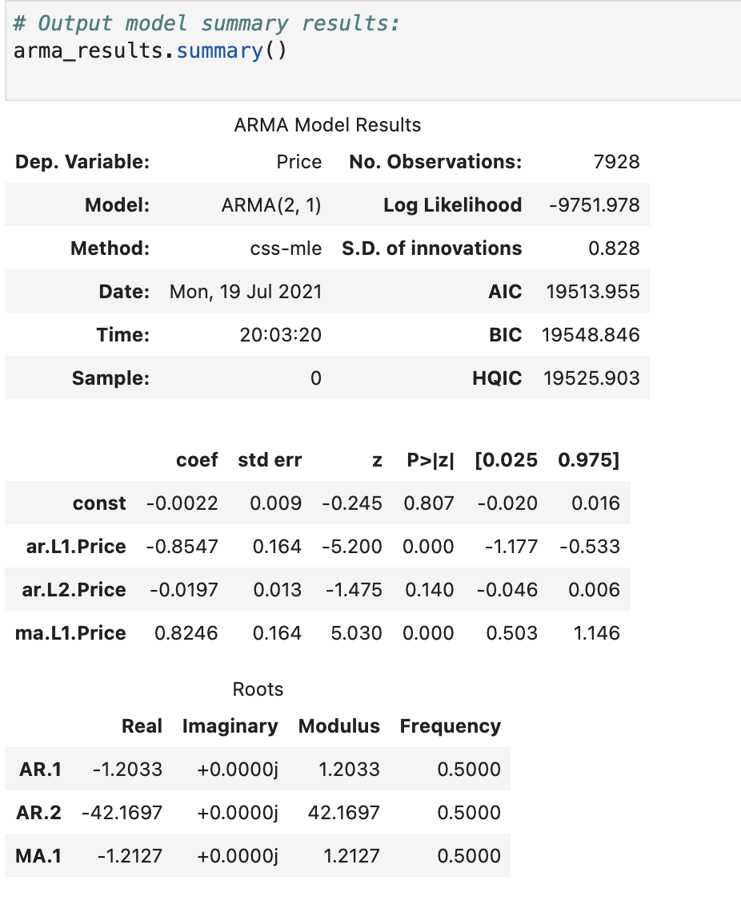
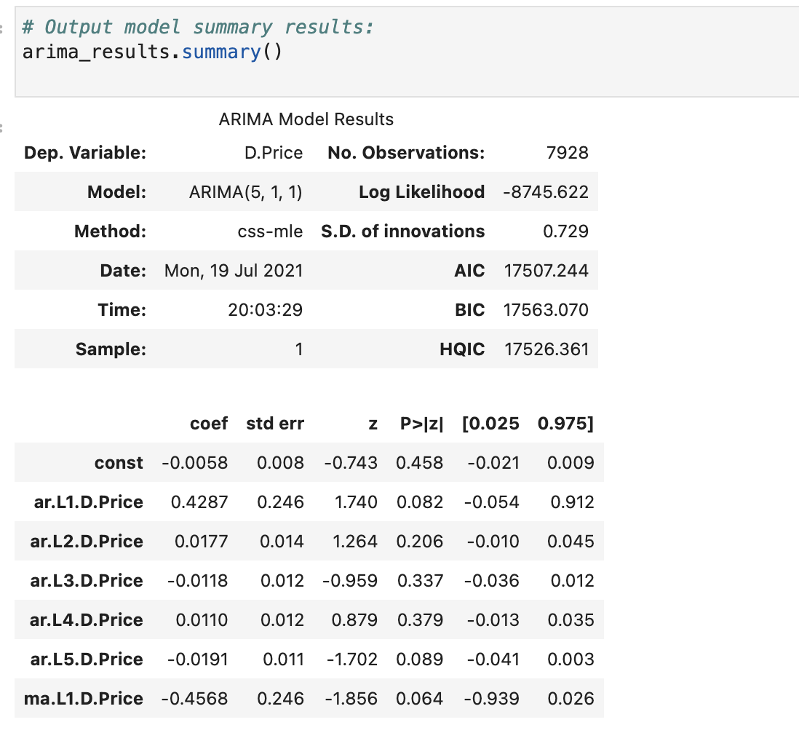
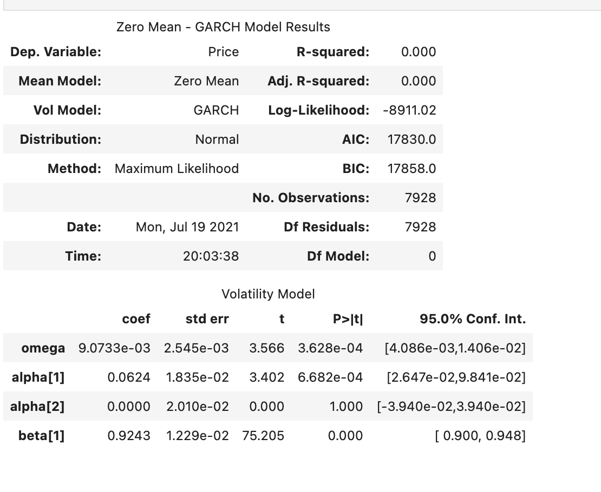
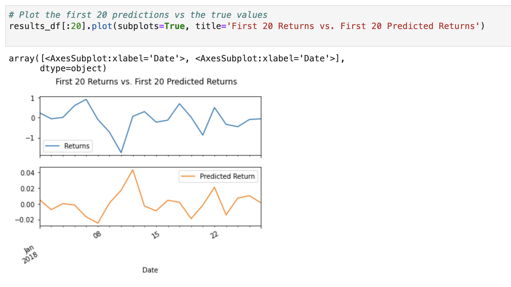

# Unit 10—A Yen for the Future

## Background

This project based in Python language used of the tools of Times Series analysis, as well as Linear Regression model, in an attempt to forescast the price of JPY - Japanese Yen versus CAD - Canadian Dollar. Additionally, ARMA, ARIMA and GARCH forecasting tools were used along with decomposition using the Hodrick-Prescott filter.

Linear Regression: in-sample and out-of-sample perfomance metrics were used to analyze Linear Regression models in the concept of the study JPY - CAD.

The models and tasks were sepparated into two notebooks:

1. Time series forecasting
2. Linear regression modelling

- - -

### Progress of analysis

The initial visualization of the currency exchange rate for CAD-JPY looked like this, showing a lot of volatility.

Using the Hodrick-Prescott Filter, I decomposed the exchange rate price into trend and noise.

Also plotted the noise isolated from price for better visualization:

ARMA results as per shown below:

ARIMA results:

Volatility with GARCH:

Predictions with Linear Regression:

